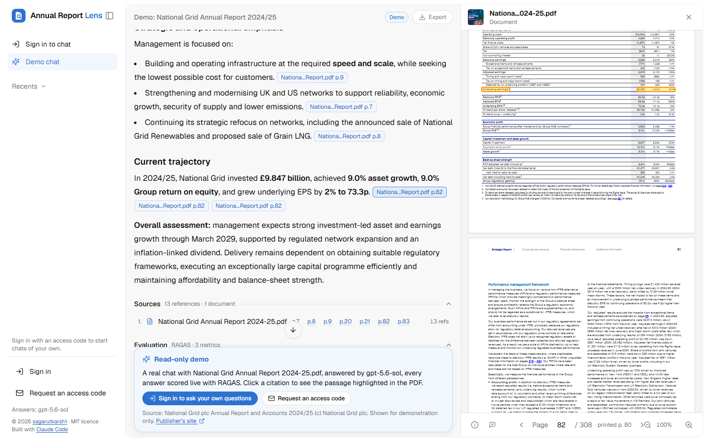
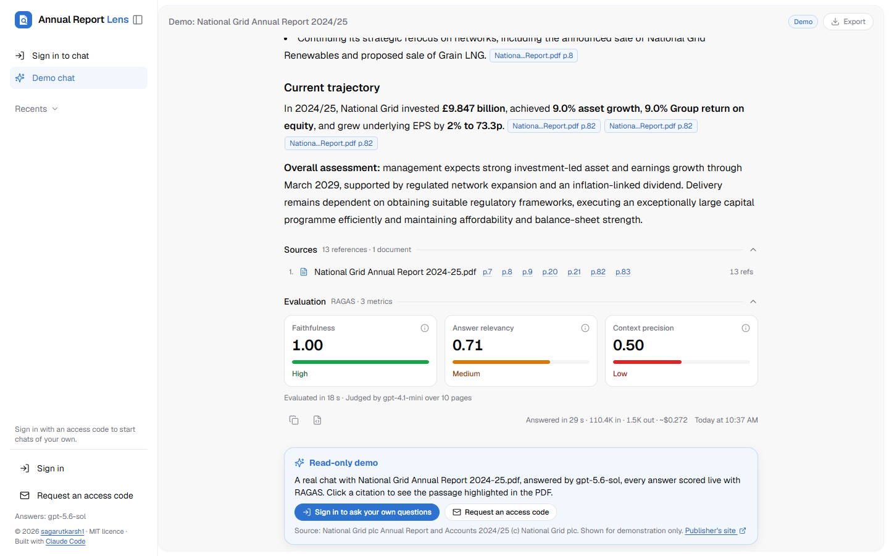
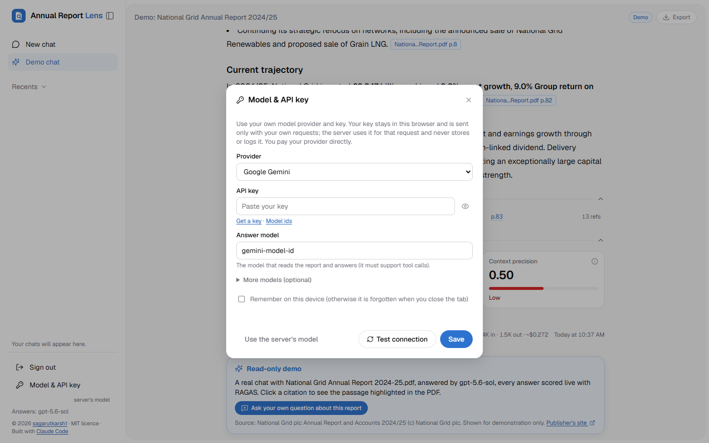
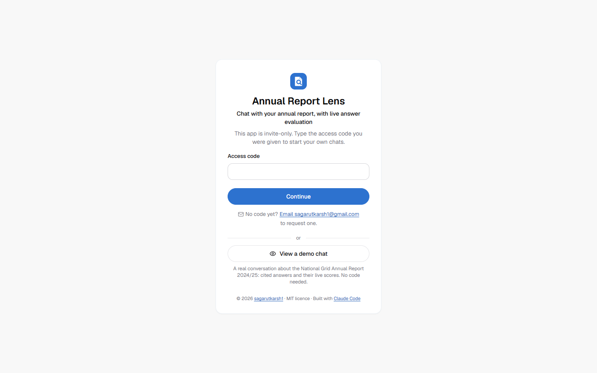
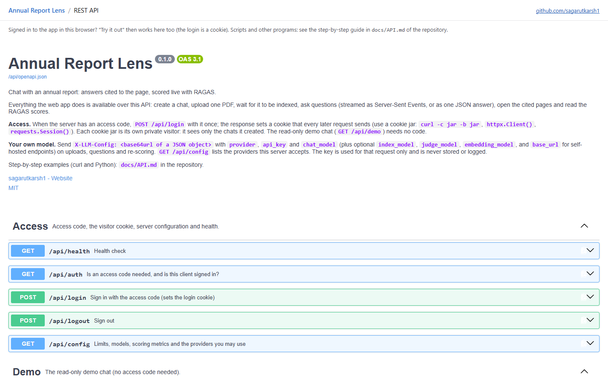
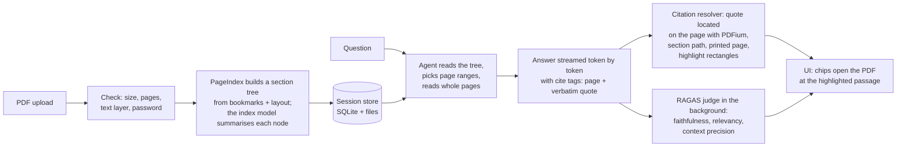

# Annual Report Lens

**Chat with your annual report, with live answer evaluation.**

Upload a company's annual report (any long, structured PDF works) and ask questions in plain English. Every answer cites the
exact pages it relies on; click a citation and the PDF opens beside the chat, scrolled to the passage, highlighted. Then each
answer is **scored live** by an AI judge with [RAGAS](https://github.com/explodinggradients/ragas): faithfulness, answer
relevancy and context precision, so you can see at a glance which answers to trust and which to check.

[](LICENSE)


-6f42c1.svg)



- **Live demo:** *add your Render link here*. Choose **View a demo chat**: a real conversation with National Grid's
  2024/25 annual report, read-only, no code needed. To ask your own questions, request an access code (link on the page).
- **API reference:** `/docs` on any running instance (Swagger UI), and [docs/API.md](docs/API.md) for curl and Python examples.

## Why it is different

| | Typical "chat with PDF" | Annual Report Lens |
|---|---|---|
| Retrieval | Chunks + embeddings + vector search: the answer is only as good as the chunks that happened to match | **Vectorless, reasoning-based** ([PageIndex](https://github.com/VectifyAI/PageIndex)): the model reads the report's table-of-contents tree, decides which sections matter and reads whole pages, the way an analyst would |
| Sources | A list of chunk snippets | **Page-level citations** (physical page, printed page number, section path such as *Strategic report > Financial review*) with the **exact passage highlighted** in the PDF |
| Trust | You have to take the answer on faith | **Live RAGAS evaluation** of every answer, with the reasons behind each score |
| Models | One vendor | OpenAI by default; visitors can **bring their own key** for Anthropic, Google Gemini, OpenRouter, Groq, Mistral, DeepSeek, xAI or Together AI, and self-hosters can use Ollama or any OpenAI-compatible endpoint |
| Integration | UI only | Every feature is a **documented REST API** (FastAPI): stream answers as Server-Sent Events or get one JSON answer |

## Screenshots

| The read-only demo: answers, sources and live scores | Bring your own provider and key |
|---|---|
|  |  |
| **Invite-only access, with a public demo** | **The REST API, documented** |
|  |  |

## How it works



1. **Index once per chat.** The PDF is validated, its text read with PDFium, and PageIndex turns the bookmarks and page layout
   into a tree of sections; a cheap model writes a summary of each node. No chunking, no embeddings, no vector database.
2. **Ask.** An agent reads the tree, chooses the page ranges that matter, reads those pages and writes the answer. The UI shows
   these steps live ("Read pages 88-90") and streams the answer.
3. **Cite.** The model tags each claim with a page and a short verbatim quote. The server finds that quote on the page
   (exact, then fuzzy, then the neighbouring pages), works out the printed page number and the section path, and computes the
   highlight rectangles. A quote whose numbers differ from the page is rejected rather than highlighted on the wrong figure.
4. **Score.** RAGAS scores the answer against the pages the agent actually read, in the background, so scores never delay the
   answer. Each metric explains itself in a tooltip.

PageIndex's own cloud service offers block-level boxes for citations; this project computes them locally instead, so it needs
no extra account and the document never leaves your chosen model provider.

## Quick start (local)

You need Python 3.10+ (3.13 recommended) and, unless you use the offline demo, an API key for OpenAI or another provider.

```bash
git clone https://github.com/sagarutkarsh1/annual-report-lens.git
cd annual-report-lens
python -m venv .venv
# Windows: .venv\Scripts\activate      macOS / Linux: source .venv/bin/activate
pip install -r requirements-deploy.txt
cp .env.example .env                    # Windows: copy .env.example .env   -- then put your key after OPENAI_API_KEY=
python -m reportlens --open             # http://127.0.0.1:8000
```

**No key? Try the offline demo:** `python -m reportlens --demo --open` starts a fake model server inside the app, so you can
click through everything (upload `samples/sample_annual_report.pdf`, ask, open citations, see scores) without any account or
cost. Demo answers are canned extracts and the scores are meaningless; it is for learning the UI.

On Windows, `.\run.ps1` (or `.\run.ps1 -Demo`) does all of the above with the project's own virtual environment. Keep the project
in a short path on Windows (the PageIndex store builds long paths).

With Docker:

```bash
docker build -t annual-report-lens .
docker run --rm -p 7860:7860 -e PUBLIC_MODE=0 -e OPENAI_API_KEY=your-key annual-report-lens     # or -e REPORTLENS_DEMO_MOCK=1
```

## Use your own model provider

**As a visitor:** sign in, open **Model & API key** in the sidebar, pick a provider, paste your key and the model id, press
**Test connection**, then **Save**. Your key stays in your browser (forgotten when the tab closes unless you tick "remember")
and is sent only with your own requests; the server uses it for that request and never stores or logs it. Work paid with your
key never counts against the server's budget.

**As the owner of a deployment:** set `LLM_PROVIDER`, `LLM_API_KEY` and the model ids in the environment:

```bash
LLM_PROVIDER=gemini            # openai | anthropic | gemini | openrouter | groq | mistral | deepseek | xai | together | ollama | custom
LLM_API_KEY=...
PI_CHAT_MODEL=<answer model id>
PI_INDEX_MODEL=<cheaper model for section summaries>      # optional, default: the answer model
RAGAS_EMBEDDING_MODEL=<embedding model id>                # optional; without it the answer-relevancy score is skipped
```

Every provider is reached through its OpenAI-compatible API, so no extra SDK is installed and memory stays low enough for a
512 MB host. The answer model must support tool calls. `VISITOR_KEYS=off|optional|required` decides whether visitors may (or
must) bring their own key.

## REST API

The web app is a thin client over a FastAPI backend, so everything it does is available to scripts:

```bash
curl -c jar -b jar -X POST https://HOST/api/login -H "Content-Type: application/json" -d '{"code": "YOUR-ACCESS-CODE"}'
SID=$(curl -s -c jar -b jar -X POST https://HOST/api/sessions | python -c "import sys,json; print(json.load(sys.stdin)['id'])")
curl -c jar -b jar -F "file=@report.pdf" https://HOST/api/sessions/$SID/document          # then poll GET /api/sessions/$SID until ready
curl -c jar -b jar -X POST https://HOST/api/sessions/$SID/ask -H "Content-Type: application/json" \
     -d '{"content": "What are the primary sources of operating cash flow?"}'
```

The last call returns the finished answer as JSON: text, citations (page, printed page, section path, quote, highlight
rectangles), usage and the RAGAS scores. `POST /api/sessions/{id}/messages` streams the same answer as Server-Sent Events.
Interactive reference at `/docs`; full walkthrough with a Python client in [docs/API.md](docs/API.md).

## Deploy for free (Render)

The repository ships a `Dockerfile` and a `render.yaml` Blueprint for **Render's free web service** (512 MB RAM, 0.1 CPU,
sleeps after 15 idle minutes). It was measured to fit with a 308-page report under exactly those limits: indexing runs in a
short-lived child process, scoring in another, and visitors' providers need no extra memory. A public copy is protected by an
access code, private chats per visitor, a spend budget, a chat cap and a per-visitor question limit.

Step-by-step guide for Windows, measured memory and timings, threat model and costs: **[docs/DEPLOY.md](docs/DEPLOY.md)**.

## Configuration

Everything is optional except a model key (or `--demo`). Precedence: real environment variables, then `.env`, then defaults.
The full annotated list is in [.env.example](.env.example); the ones you are most likely to touch:

| Setting | Default | Meaning |
|---|---|---|
| `OPENAI_API_KEY` / `LLM_API_KEY` | none | The server's model key. Never shown by the API or the UI. |
| `LLM_PROVIDER` | `openai` | The server's provider (see above). |
| `PI_CHAT_MODEL` / `PI_INDEX_MODEL` | `gpt-5.6-sol` / `gpt-5.6-luna` | Answer model / section-summary model. |
| `PI_CHAT_REASONING_EFFORT` | `medium` | For OpenAI reasoning models. |
| `RAGAS_JUDGE_MODEL` / `RAGAS_EMBEDDING_MODEL` | `gpt-4.1` / `text-embedding-3-small` | The judge and the embeddings behind answer relevancy. `EVAL_ENABLED=false` turns scoring off. |
| `ACCESS_CODE` | none | Set it and every visitor needs the code; chats become private per browser. |
| `ACCESS_REQUEST_EMAIL` | none | Shown on the code screen: "No code yet? Email ... to request one." |
| `VISITOR_KEYS` | `optional` | `off`, `optional` or `required`: may visitors bring their own provider key? |
| `DEMO_DIR` | `demo/` | Folder of the read-only demo chat ([demo/README.md](demo/README.md)); empty = no demo. |
| `PUBLIC_MODE` | `0` | Safe public defaults: budget 10 USD, chat cap, per-visitor question limit, smaller uploads. |
| `MAX_UPLOAD_MB` / `MAX_PAGES` | `100` / `1200` | Upload limits (public: 25 / 400). |
| `LOW_MEMORY` | automatic | Small-host mode (child-process indexing and scoring); on automatically in a container with 600 MB or less. |

## What the scores mean (and don't)

All three are **estimates by an AI judge**, not measured accuracy; they move a few points between runs and are not comparable
across judge models.

| Score | What it measures | Caveat |
|---|---|---|
| Faithfulness | Share of the answer's claims the judge can verify from the pages the agent read | Calculated figures (growth rates, totals) are often marked unsupported even when right |
| Answer relevancy | How well the question can be recovered from the answer alone | Not correctness: "the report does not say" scores low even when it is the right answer. Needs an embeddings model |
| Context precision | How many of the pages read were useful, with more credit when useful pages came first | Judged against the generated answer, not a verified one |

A metric that fails shows "n/a" with the reason, never 0. Use the scores to decide which answers to check, not as pass/fail.

## Costs

Measured on National Grid's 308-page 2024/25 report with OpenAI (`gpt-5.6-sol` at medium effort): indexing about $0.30 once
per report, a question $0.27 to $0.64, scoring a few cents more. Question cost grows with the report's length because the agent
re-reads the outline. With your own key you pay your provider directly; cheaper models work, at some cost in answer quality.

## Project layout

```
reportlens/              the application (Python package)
  service.py             sessions, uploads, questions, scoring, the demo, private chats (no web imports)
  indexer.py             background indexing (optionally in a child process) with progress
  qa.py                  the agent run -> streamed events, pages read, tokens and cost
  citations.py           cite tags -> citations       locator.py, pdfutil.py   quote -> highlight rectangles, printed page numbers
  evaluation.py          RAGAS scoring (eval_child.py: in a child process on small hosts)
  providers.py           model providers and visitors' own keys      demo.py   the read-only demo chat
  pageindex_compat.py    the one place that adapts the PageIndex SDK  store.py  SQLite      config.py  settings
  web/                   FastAPI app, routes, auth (access code, visitor cookie), SSE, static/ (the UI, no build step)
devtools/mock_openai.py  the fake model server behind --demo and the tests
scripts/                 export_demo.py, make_deploy_bundle.py, render_limits_test.py, live_smoke.py, make_sample_pdf.py
samples/                 a synthetic 60-page report with known facts      demo/   the demo chat (contents not in git)
tests/                   1,200+ offline tests                              docs/   ARCHITECTURE.md, DEPLOY.md, API.md
```

## Tests

```bash
python -m pip install pytest pytest-asyncio reportlab
python -m pytest -q                      # everything offline, about 8 minutes; -m "not slow" skips the end-to-end runs
```

Tests never touch the network or real data: they use temporary folders and the fake model server, including end-to-end runs of
the real PageIndex SDK, the citation resolver and RAGAS behind a real server. `scripts/live_smoke.py --yes` is the optional,
paid check against a real key (it prints the estimated cost and refuses to spend without `--yes`).

## Troubleshooting

| Symptom | What to do |
|---|---|
| Banner says no API key | Put the key in `.env` and restart, use your own key under **Model & API key**, or run `--demo`. |
| "model not found or no access" | The model id is wrong for that key or provider. Check it under **Model & API key** (Test connection) or in `.env`. |
| Indexing fails with "no bookmarks" | Public mode refuses PDFs without an outline (they cost more and are slow). Set `PI_INDEX_FALLBACK_STANDARD=true` to allow them. |
| "looks scanned" / "no text layer" | The PDF has no selectable text: run OCR first. |
| Rate limit (429) while indexing | Lower `PI_INDEX_SUMMARY_CONCURRENCY` (8, then 4) and upload again. "Out of credit" is a billing problem. |
| Highlight a line off, or the whole page flashes | Tables and multi-column pages are the hard cases; the viewer says whether the passage itself was found. |
| On Windows, odd failures at the end of indexing | Path length: keep the project in a short folder or set `REPORTLENS_DATA_DIR=C:\rl\data`. |

## Security

Access code with lockout, private chats per browser, a read-only demo, visitors' keys never stored or logged, custom model URLs
refused on public servers (no SSRF), strict Content-Security-Policy, no CDN at runtime. Details and how to report a
vulnerability: [SECURITY.md](SECURITY.md). Document text and questions go to the model provider that answers; do not upload
confidential documents to a public demo.

## Roadmap

- Several documents per chat and comparisons across years or companies
- Answer-level "check this figure" mode that recomputes numbers from the cited table
- Accounts with saved chats and per-user budgets; per-person access codes
- OCR for scanned reports; chart and image understanding
- Score calibration against human-judged answers; an evaluation dashboard across chats

## Credits

Created and owned by **[sagarutkarsh1](https://github.com/sagarutkarsh1)**.

Built with [Claude Code](https://claude.com/claude-code) by Anthropic, which wrote and tested the code with the author.

Standing on [PageIndex](https://github.com/VectifyAI/PageIndex) (vectorless retrieval), [RAGAS](https://github.com/explodinggradients/ragas)
(evaluation), the [OpenAI Agents SDK](https://github.com/openai/openai-agents-python), [FastAPI](https://fastapi.tiangolo.com),
[PDFium](https://pdfium.googlesource.com/pdfium/) via [pypdfium2](https://github.com/pypdfium2-team/pypdfium2) and
[pdf.js](https://mozilla.github.io/pdf.js/). Full list with licences: [THIRD_PARTY_NOTICES.md](THIRD_PARTY_NOTICES.md).
PyMuPDF is deliberately not used (AGPL).

## Licence

[MIT](LICENSE) © 2026 sagarutkarsh1. You may use, change and share the code, including commercially, as long as the copyright
and licence notice stay with it. Third-party components keep their own licences.
